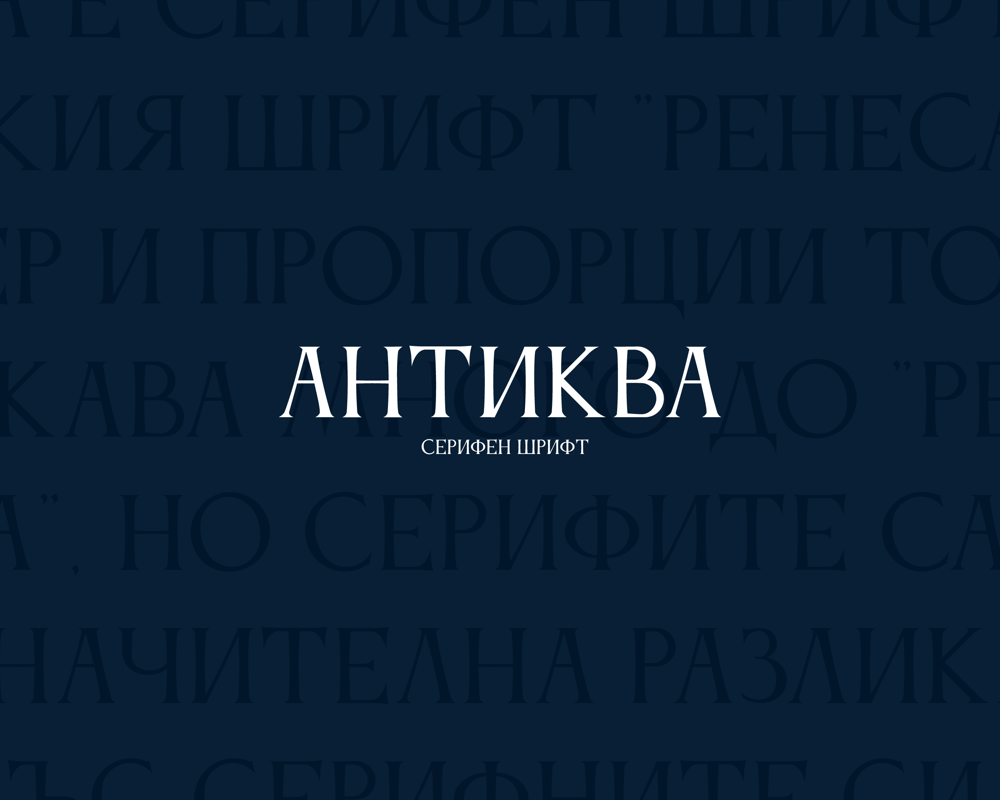
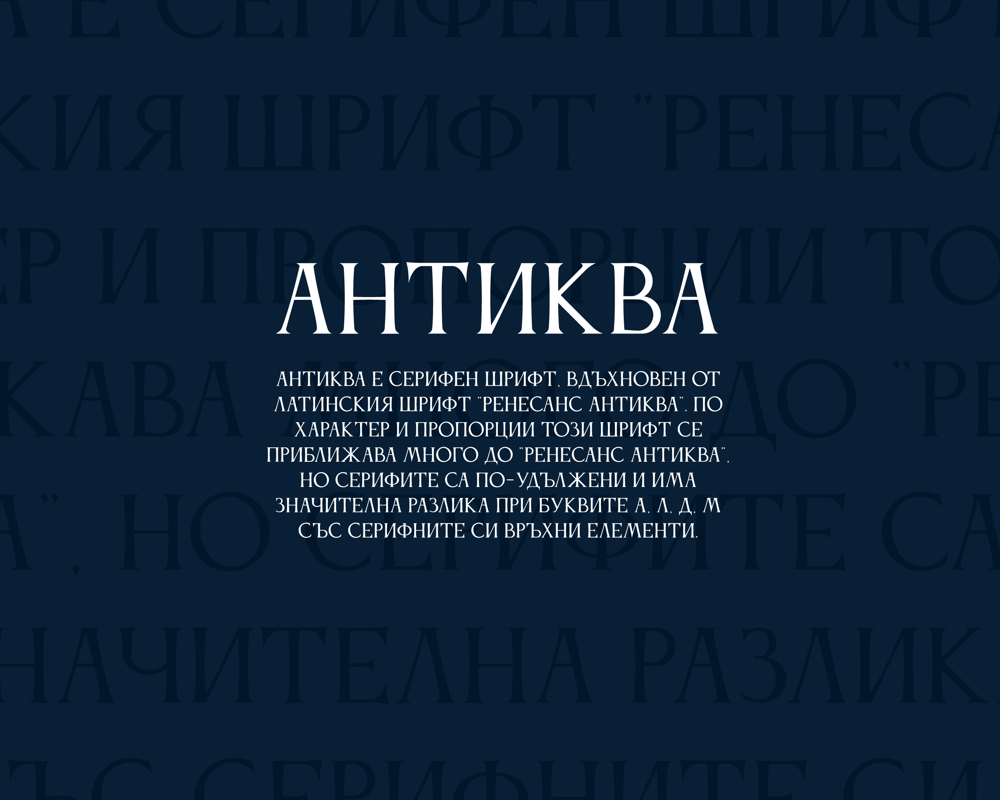
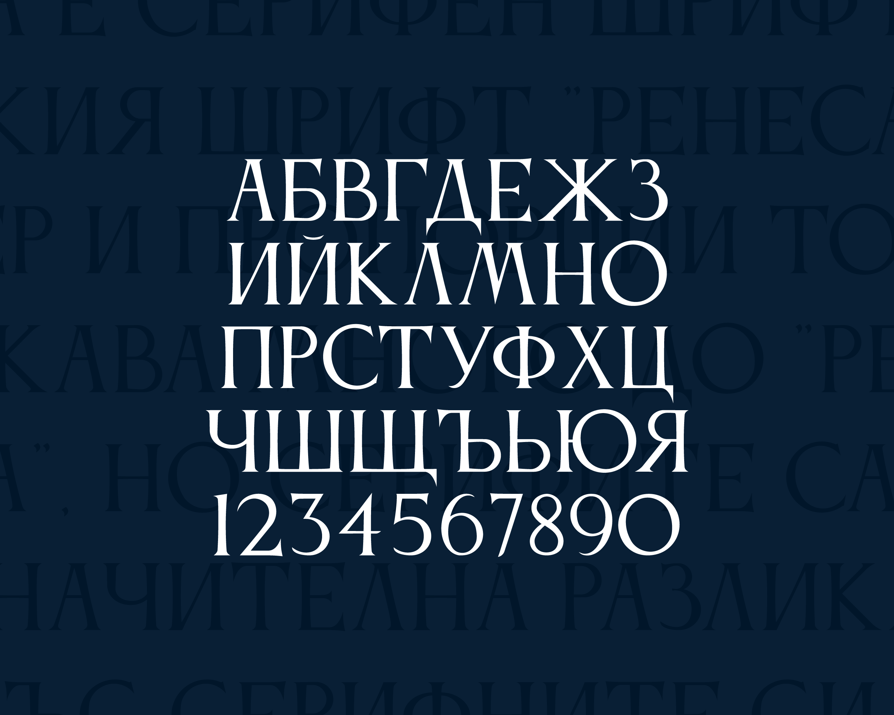

# Anticva
Anticva is a serif font designed by Konstantin Krastev. 

 

# Basic Information
Antiqua is a serif font inspired by the Latin Renaissance Antiqua font. In character and proportions this font is very close to "Renaissance Antiqua", but the serifs are more elongated and there is a significant difference in the letters A, L, D, M with their serif upper elements.

**Language Support**
Bulgarian 

At the moment Anticva supports only Bulgarian language, but in the next version we will cover ISO Latin 1 Character Encoding. 

## ChangeLog

This is version 1.000.

# License

Anticva is licensed under the SIL Open Font License v1.1 (http://scripts.sil.org/OFL).
