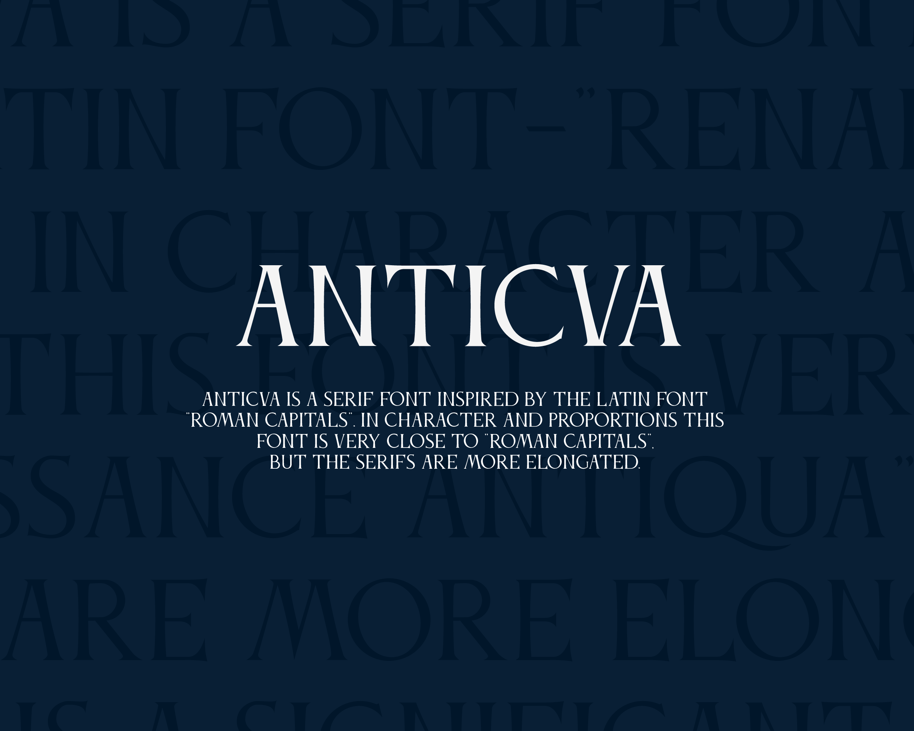
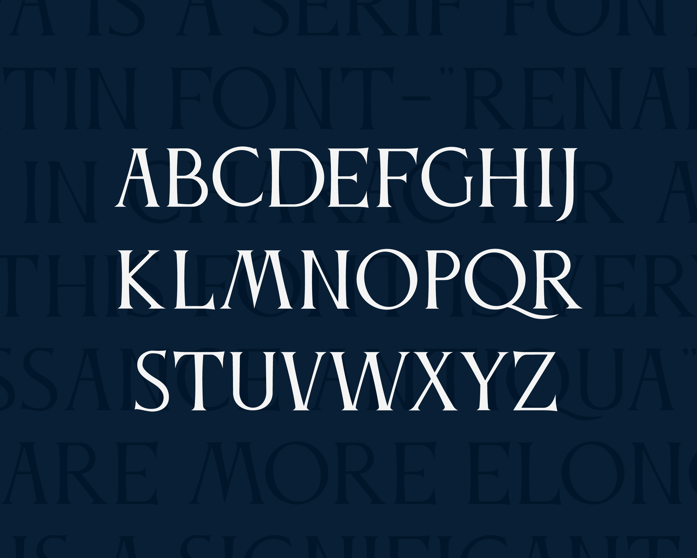

# Anticva
Anticva is a serif font designed by Konstantin Krastev. 

 

# Basic Information
Antiqua is a serif font inspired by the Latin "Roman Capitals" font. In character and proportions this font is very close to "Roman Capitals", but the serifs are more elongated and there is a significant difference in the letters A, L, D, M with their serif upper elements.

**Language Support**
Afrikaans Albanian Basque Breton Bulgarian, Corsican, English, Faroese, Galician, Icelandic, Irish, Indonesian, Italian, Leonese, Luxembourgish, Malay, Manx, Norwegian, Occitan, Portuguese, Rhaeto-Romanic, Scottish Gaelic, Scots, Southern Sami, Spanish, Swahili, Swedish, Tagalog, Walloon

## ChangeLog

This is version 1.1.

# License

Anticva is licensed under the SIL Open Font License v1.1 (http://scripts.sil.org/OFL).
